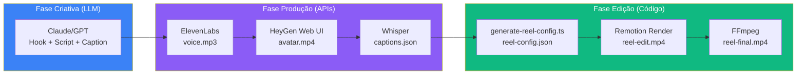

# AI Reels Squad v3.0

Squad para criar Instagram Reels (15-90s) com clone de voz e avatar IA.
Stack: ElevenLabs Creator (voz PT-BR PVC) + HeyGen Creator (lip sync avatar) + Remotion (pós-produção).

**Status**: DEVELOPING | **Target**: 4-5 reels/semana | **Custo**: $51/mês

---

## Fluxograma do Pipeline

```mermaid
flowchart TD
    START([Tema do Reel]) --> HOOK

    subgraph FASE1["Fase 1 — Hook"]
        HOOK[hook-architect<br/>3 primeiros segundos]
        HOOK --> QG1{QG-AR-1<br/>Score >= 8/10?}
        QG1 -->|FAIL| HOOK
    end

    QG1 -->|PASS| SCRIPT

    subgraph FASE2["Fase 2 — Script"]
        SCRIPT[script-director<br/>7 beats + direção 10D]
        SCRIPT --> QG2{QG-AR-2<br/>7 beats + timing OK?}
        QG2 -->|FAIL| SCRIPT
    end

    QG2 -->|PASS| VOICE

    subgraph FASE3["Fase 3 — Voz"]
        VOICE[voice-engineer<br/>ElevenLabs TTS]
        VOICE --> QG3{QG-AR-3<br/>Fidelidade >= 80%?}
        QG3 -->|FAIL| VOICE
    end

    QG3 -->|PASS| VIDEO

    subgraph FASE4["Fase 4 — Avatar"]
        VIDEO[avatar-director<br/>HeyGen lip sync]
        VIDEO --> QG4{QG-AR-4<br/>Sync OK + identidade?}
        QG4 -->|FAIL| VIDEO
    end

    QG4 -->|PASS| EDIT

    subgraph FASE5["Fase 5 — Edição"]
        EDIT[video-composer<br/>Remotion render]
        EDIT --> QG5{QG-AR-5<br/>1080x1920 + legendas?}
        QG5 -->|FAIL| EDIT
    end

    QG5 -->|PASS| CAPTION

    subgraph FASE6["Fase 6 — Caption"]
        CAPTION[script-director<br/>Copy Instagram]
        CAPTION --> QG6{QG-AR-6<br/>Voice DNA + CTA?}
        QG6 -->|FAIL| CAPTION
    end

    QG6 -->|PASS| QA

    subgraph FASE7["Fase 7 — QA"]
        QA[qa-sentinel<br/>Checklist 14 itens]
        QA --> QG7{QG-AR-7<br/>14/14 + Tiago aprova?}
        QG7 -->|FAIL| QA
    end

    QG7 -->|PASS| OUTPUT([Reel Publicado])

    style START fill:#1a1a2e,color:#fff
    style OUTPUT fill:#16a34a,color:#fff
    style QG1 fill:#f59e0b,color:#000
    style QG2 fill:#f59e0b,color:#000
    style QG3 fill:#f59e0b,color:#000
    style QG4 fill:#f59e0b,color:#000
    style QG5 fill:#f59e0b,color:#000
    style QG6 fill:#f59e0b,color:#000
    style QG7 fill:#f59e0b,color:#000
```



## Fluxograma Técnico (ferramentas)



---

## Arquitetura de Agentes

| Agente | Tier | Papel | Frameworks |
|---|---|---|---|
| ai-reels-chief | T0 | Orquestrador pipeline 7 fases | Pipeline orchestration |
| hook-architect | T1 | Hooks 3 primeiros segundos | Hook-Retain-Reward (Hormozi), 7Fs (Bourgoin), Hook Point (Kane) |
| script-director | T1 | Roteiro 7 beats + direção 10D | Eight-Point Arc (Blackman), Performance Direction |
| voice-engineer | T1 | Clonagem de voz PT-BR | ElevenLabs multilingual_v2, PVC, speed 1.15 |
| avatar-director | T1 | Lip sync talking head | HeyGen Creator (web UI) |
| video-composer | T2 | Pós-produção programática | Remotion 4.0.427, FFmpeg |
| qa-sentinel | T2 | QA binário + gate humano | Checklist 14 itens, Devil's Advocate |

---

## Remotion — Composição `ReelEdit`

O coração da edição automática. Cada reel é gerado a partir de um `reel-config.json` — zero código por vídeo.

### 8 Camadas Visuais

```
┌─────────────────────────┐
│  8. Film Grain           │  noise3D (Remotion), opacity 0.05
│  7. Progress Bar         │  3px topo, cor do accent
│  6. Lower Third          │  Nome + @handle, slide-in com spring
│  5. Keyword Overlays     │  Texto animado em timestamps
│  4. Auto Captions        │  TikTok-style word-by-word
│  3. Vignette             │  Radial gradient cinematográfico
│  2. Cut Flash            │  Flash branco nos pontos de corte
│  1. OffthreadVideo       │  Avatar HeyGen com punch-in/out
└─────────────────────────┘
```

### Config-Driven — Exemplo `reel-config.json`

```json
{
  "slug": "ia-copiloto",
  "videoSrc": "heygen-avatar.mp4",
  "captionsSrc": "captions.json",
  "autoCuts": {
    "enabled": true,
    "intervalS": 4,
    "closeUpScale": 1.2,
    "hookScale": 1.25,
    "ctaScale": 1.15
  },
  "keywords": [
    { "text": "IA", "fromS": 6.08, "toS": 6.72, "position": "top", "color": "#C9A84C", "size": 90 }
  ],
  "lowerThird": {
    "name": "Tiago Guimarães",
    "handle": "@tiag8guimaraes",
    "showFromS": 2,
    "showToS": 6
  },
  "captionStyle": {
    "switchMs": 1200,
    "highlightColor": "#C9A84C",
    "fontSize": 44
  },
  "features": {
    "cutFlash": true,
    "vignette": true,
    "grain": true,
    "progressBar": true,
    "captions": true,
    "lowerThird": true
  }
}
```

### Auto-Cuts — Algoritmo

O sistema gera cortes automaticamente a partir das pausas detectadas no `captions.json` (Whisper):

1. Detecta gaps > 200ms entre palavras
2. Gera pontos de corte em pausas naturais (intervalo mínimo ~70% do `intervalS`)
3. Preenche gaps com cortes em intervalo fixo
4. Alterna normal (scale 1.0) / close-up (scale 1.2) com variações
5. Hook usa scale maior (1.25), CTA final usa ease-in longo

### Comandos de Render

```bash
# Preview no browser (Remotion Studio)
cd squads/ai-reels/remotion && npx remotion studio src/index.ts

# Render MP4
npx remotion render src/index.ts ReelEdit --output out/reel.mp4

# Render com codec específico
npx remotion render src/index.ts ReelEdit --output out/reel.mp4 --codec h264

# Normalizar áudio (pós-render)
ffmpeg -y -i out/reel.mp4 -af "loudnorm=I=-14:TP=-1.5:LRA=11" -c:v copy out/reel-final.mp4
```

### Specs Técnicas

| Parâmetro | Valor |
|---|---|
| Resolução | 1080x1920 (9:16) |
| FPS | 25 |
| Codec | H.264 |
| Áudio | -14 LUFS (normalizado FFmpeg) |
| Formato | MP4 |
| Duração | 15-90s (detecta do vídeo) |

---

## Stack Técnica

| Componente | Ferramenta | Custo | Status |
|---|---|---|---|
| TTS / Voz | ElevenLabs Creator (PVC, speed 1.15) | $22/mês | ✅ Ativo |
| Lip Sync / Avatar | HeyGen Creator (web UI) | $29/mês | ⏳ Assinar |
| Pós-produção | Remotion 4.0.427 | $0 | ✅ Configurado |
| Legendas | Whisper (word-level) → @remotion/captions | $0 | ✅ |
| Normalização áudio | FFmpeg (-14 LUFS) | $0 | ✅ |

### Decisões Técnicas

| Decisão | Escolha | Alternativas rejeitadas |
|---|---|---|
| Lip sync | **HeyGen Creator $29/mo** | MuseTalk (borrado), LatentSync (dessync), Kling (10s limite) |
| Edição | **Remotion** (programático) | CapCut (manual), FFmpeg puro (limitado) |
| Velocidade voz | **1.15x** | 1.0x (lento demais para reels) |
| Captions | **@remotion/captions** (TikTok-style) | SRT overlay (estático, sem animação) |
| Grain | **noise3D** (@remotion/noise) | SVG feTurbulence (mais leve, pior resultado) |

---

## Scripts

| Script | Descrição |
|---|---|
| `scripts/elevenlabs-tts.ts` | Gera áudio via ElevenLabs API (TTS) |
| `scripts/whisper-captions.ts` | Gera captions word-by-word via Whisper |
| `scripts/generate-reel-config.ts` | Gera `reel-config.json` a partir de captions + metadados |
| `scripts/test-lipsync.sh` | Testa lip sync tools (MuseTalk, LatentSync, etc.) |

## Workflows

| Workflow | Descrição |
|---|---|
| `wf-reel-production.yaml` | Pipeline completo para 1 reel (7 fases sequenciais) |
| `wf-batch-production.yaml` | Produção semanal batch (4-5 reels com aprovação em lote) |

## Quality Gates

| Gate | Fase | Critério |
|---|---|---|
| QG-AR-1 | Hook | Score >= 8/10, curiosity gap + fórmula comprovada |
| QG-AR-2 | Script | 7 beats completos, duração 15-90s, timing validado |
| QG-AR-3 | Voz | Fidelidade >= 80%, zero artefatos, pronúncia PT-BR |
| QG-AR-4 | Lip Sync | Sync sem dessincronização + identidade preservada |
| QG-AR-5 | Edição | 1080x1920 9:16, legendas, duração correta |
| QG-AR-6 | Caption | Voice DNA pass, CTA específico, guardrail 10/10 |
| QG-AR-7 | QA Final | 14/14 checklist, devil's advocate, aprovação Tiago |

---

## Pré-requisitos

| # | Pré-requisito | Status | Como |
|---|---|---|---|
| 1 | ElevenLabs Creator ($22/mês) | ✅ | `ELEVENLABS_API_KEY` no `.env` |
| 2 | Voice clone criado (PVC) | ✅ | Voice ID: `YenbYX8x7myujzTnQhXP` |
| 3 | HeyGen Creator ($29/mês) | ⏳ | Assinar em app.heygen.com |
| 4 | Vídeo-template gravado | ✅ | 1080x1920, câmera frontal, fundo neutro |
| 5 | Remotion instalado | ✅ | `cd remotion && npm install` |
| 6 | FFmpeg disponível | ✅ | `brew install ffmpeg` |
| 7 | Whisper disponível | ✅ | Via OpenAI API ou local |

Setup completo: `squads/ai-reels/docs/setup-guide.md`

## Custos

| Item | Custo/mês |
|---|---|
| ElevenLabs Creator | $22 |
| HeyGen Creator | $29 |
| Remotion | $0 (open source) |
| FFmpeg + Whisper | $0 |
| **Total** | **$51/mês** |

Capacidade: ~15 reels/mês (limitado por HeyGen 15min/mês no plano Creator).

---

## Estrutura de Arquivos

```
squads/ai-reels/
├── README.md                  # Este arquivo
├── config.yaml                # Configuração do squad
├── agents/                    # 7 agentes (T0 + T1 + T2)
│   ├── ai-reels-chief.md      # Orquestrador
│   ├── hook-architect.md       # Hooks
│   ├── script-director.md      # Roteiro
│   ├── voice-engineer.md       # Voz
│   ├── avatar-director.md      # Avatar
│   ├── video-composer.md       # Edição
│   └── qa-sentinel.md          # QA
├── tasks/                     # Tasks por fase
├── workflows/                 # Orquestração
│   ├── wf-reel-production.yaml
│   └── wf-batch-production.yaml
├── checklists/                # Quality gates
├── templates/                 # Templates de output
├── data/                      # Knowledge base + tool stack
├── scripts/                   # Scripts de automação
│   ├── elevenlabs-tts.ts
│   ├── whisper-captions.ts
│   ├── generate-reel-config.ts
│   └── test-lipsync.sh
├── remotion/                  # Projeto Remotion
│   ├── package.json           # Remotion 4.0.427
│   ├── src/
│   │   ├── index.ts           # Entry point
│   │   ├── Root.tsx            # Composition registry
│   │   ├── ReelComposition.tsx # 8 camadas visuais
│   │   ├── auto-cuts.ts       # Algoritmo de cortes
│   │   └── types.ts           # TypeScript types
│   ├── public/                # Assets (vídeo, captions, config)
│   └── out/                   # Renders (gitignored)
├── docs/                      # Guias internos
└── assets/                    # Assets compartilhados
```

## Comandos

| Comando | Descrição |
|---|---|
| `*create-reel "<tema>"` | Pipeline completo para 1 reel |
| `*batch-reels` | Produção semanal batch (4-5 reels) |
| `*generate-hooks "<tema>"` | Gerar 5 variações de hook |
| `*write-script "<tema>"` | Roteiro 7 beats completo |
| `*synth-voice <script.txt>` | Síntese de voz via ElevenLabs |
| `*render-edit` | Editar vídeo via Remotion |
| `*qa-review <reel.mp4>` | QA binário + checklist 14 itens |

## Cross-References

- **content-engine**: `workflows/reels-creation.md` (workflow criativo), `checklists/reels-checklist.md`
- **docs/instagram**: `hook-formulas.md`, `reels-performance-direction.md`
- **docs/content/data**: `voice-dna.md` (guardrail de voz), `storytelling.md`
- **instagram-spy**: detecção de tendências, auditoria de hooks, triggers 7Fs
- **research**: `docs/research/2026-02-20-lip-sync-apis/` (comparativo 21 ferramentas)
- **research**: `docs/research/2026-02-21-remotion-instagram-reels/` (best practices YouTube)
