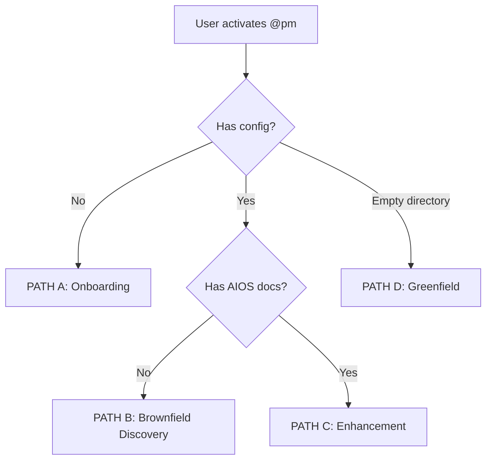
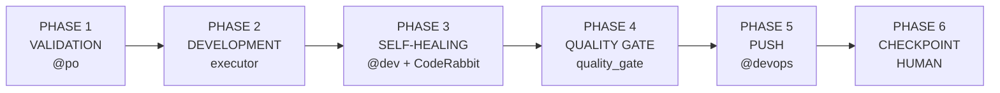

# 🎩 Magic BOB - Autonomous Orchestration Squad

**BOB** = **B**uild, **O**rchestrate, **B**alance

Autonomous orchestration system for AIOS projects. BOB detects your project state, spawns specialized agents in separate terminals, manages complete development cycles, and maintains persistent sessions with strategic human checkpoints.

---

## 🌟 What is Magic BOB?

Magic BOB is the **autonomous PM mode** of AIOS that transforms software development into a guided, semi-automated experience:

```
User: "Add JWT authentication"
  ↓
BOB: Detects project state → Spawns @architect for design
     → Spawns @data-engineer for schema → Spawns @dev for implementation
     → Quality gate by @qa → Push by @devops
     → CHECKPOINT: "Story complete! GO/PAUSE/REVIEW/ABORT?"
```

### Core Principles

1. **CLI First** - Observability panel (stdout) ALWAYS works, zero external dependencies
2. **Deterministic Routing** - Decision tree is pure if/else logic, not LLM reasoning
3. **Human Checkpoints** - BOB pauses at critical decisions for approval
4. **Session Persistence** - Crash detection and resume from where you left off
5. **Quality Gates** - Segregated reviewers (quality_gate ≠ executor)

---

## 🚀 Quick Start

### Activate BOB Mode

```yaml
# .aios/config.yaml or ~/.aios/user-config.yaml
user_profile: bob
```

### Use BOB

```bash
# Activate PM agent in BOB mode
@pm

# BOB automatically:
# 1. Detects project state (Greenfield/Brownfield/Enhancement)
# 2. Runs appropriate workflow
# 3. Spawns agents as needed
# 4. Manages development cycle
# 5. Asks for approval at checkpoints
```

---

## 🏗️ Architecture

### Decision Tree (Deterministic)



| PATH | Condition | Workflow | Duration |
|------|-----------|----------|----------|
| **A: Onboarding** | No config | Setup wizard | ~15 min |
| **B: Brownfield** | Code without AIOS docs | Discovery + analysis | ~2-4 hours |
| **C: Enhancement** | AIOS project | PRD → Epic → Stories → Dev | Varies |
| **D: Greenfield** | Empty project | Full architecture → Dev | ~4-8 hours |

### Development Cycle (6 Phases)



---

## 📦 Squad Structure

```
squads/magic-bob/
├── squad.yaml                    # Manifest
├── README.md                     # This file
├── agents/
│   ├── bob-orchestrator.md      # PM in BOB mode
│   ├── bob-guardian.md          # Quality gate specialist
│   └── bob-validator.md         # Surface checker
├── tasks/
│   ├── orchestrate-project.md
│   ├── brownfield-discovery.md
│   ├── greenfield-setup.md
│   ├── enhancement-workflow.md
│   ├── checkpoint-story.md
│   ├── surface-decision.md
│   └── session-resume.md
├── workflows/
│   ├── brownfield-discovery.yaml
│   ├── greenfield-fullstack.yaml
│   ├── enhancement.yaml
│   └── story-development-cycle.yaml
├── core/
│   ├── bob-orchestrator.js      # Main orchestrator (1106 lines)
│   ├── brownfield-handler.js
│   ├── greenfield-handler.js
│   └── observability/
│       ├── panel.js             # CLI observability
│       ├── status-writer.js     # Dashboard bridge
│       └── dashboard-emitter.js # WebSocket events
├── data/
│   ├── surface-criteria.yaml    # When to interrupt
│   ├── decision-heuristics.md   # Routing logic
│   └── voice-swipe-file.md      # BOB's tone/voice
├── checklists/
│   ├── project-state-detection.md
│   ├── session-resume-options.md
│   └── quality-gate-checklist.md
└── config/
    ├── coding-standards.md
    └── tech-stack.md
```

---

## 🎯 Features

### Surface Criteria (When BOB Interrupts)

BOB evaluates these criteria BEFORE every significant decision:

| Code | Criterion | Action |
|------|-----------|--------|
| **C001** | Cost > $5 | "This will consume ~$X. Confirm?" |
| **C002** | Risk = HIGH | "High risk operation. GO/NO-GO?" |
| **C003** | Multiple valid options | "Found N options. Which do you prefer?" |
| **C004** | 2+ consecutive errors | "Need help. Retry/Skip/Abort?" |
| **C005** | Destructive action | **ALWAYS confirm** (NEVER bypassable) |
| **C006** | Scope expanded | "Scope grew. Confirm expansion?" |
| **C007** | External dependency | "Needs API key/service. Provide?" |

### Observability (CLI First)

**Minimal Mode** (default):
```
┌─────────────────────────────────────────────┐
│ 🤖 Bob                          ⏱ 23m15s   │
│ [PRD ✓] → [Epic ✓] → [3/8] → [Dev ●] → QA │
│ @dev — implementing jwt-handler             │
│ Terminals: 2 (@dev, @data-engineer)         │
└─────────────────────────────────────────────┘
```

**Detailed Mode** (educational_mode: true):
```
┌─────────────────────────────────────────────┐
│ 🤖 Bob                          ⏱ 23m15s   │
│ [PRD ✓] → [Epic ✓] → [3/8] → [Dev ●] → QA │
│                                             │
│ Current: @dev (Dex)                         │
│ Task: implementing jwt-handler              │
│ Why: Story type 'code_general' → @dev       │
│                                             │
│ Tradeoffs considered:                       │
│  • jose vs jsonwebtoken (chose jose: ESM)   │
│  • Stateless vs DB sessions (chose JWT)     │
│                                             │
│ Terminals: 2                                │
│  @dev pid:12345 — jwt-handler (4m32s)       │
│  @data-engineer pid:12346 — schema (2m15s)  │
│                                             │
│ Next: Quality Gate → @architect             │
└─────────────────────────────────────────────┘
```

### Session Persistence

BOB saves session state at every phase transition:

```yaml
# .aios/.session-state.yaml
session_state:
  epic:
    id: epic-12
    title: Authentication System
  progress:
    current_story: 12.3
    completed: [12.1, 12.2]
  workflow:
    current_phase: development
    phase_results: {...}
  last_updated: "2026-02-15T10:30:00Z"
```

**Crash Detection:**
- If `last_updated` > 30min ago → Crash detected
- BOB offers: CONTINUE | REVIEW | RESTART | DISCARD

---

## 🔧 Configuration

### Squad Config (`squad.yaml`)

```yaml
config:
  extends: extend  # Inherit core + add BOB rules
  coding-standards: config/coding-standards.md
  tech-stack: config/tech-stack.md
```

### User Config (`~/.aios/user-config.yaml`)

```yaml
user_profile: bob           # Activate BOB mode
educational_mode: false     # Minimal panel (default)
```

### Project Config (`.aios/config.yaml`)

```yaml
coderabbit_integration:
  enabled: true             # Self-healing phase
default_model: claude-opus-4-5-20250514
```

---

## 🧪 Quality Metrics

From QA analysis (`docs/qa/magic-bob-analysis.md`):

| Dimension | Rating | Status |
|-----------|--------|--------|
| **Code Quality** | 8.5/10 | ✅ Good |
| **Architecture** | 9.0/10 | ✅ Excellent |
| **Completeness** | 8.0/10 | ~85% complete |
| **Security** | 7.5/10 | ⚠️ 3 concerns (mitigable) |
| **Performance** | 8.0/10 | ✅ Adequate |
| **Documentation** | 9.5/10 | ✅ Exceptional |

**Known Limitations:**
- NPX installer (Story 12.9) not yet implemented
- Enhancement workflow ~70% complete
- Telemetry for "70% QG pass" metric pending

---

## 🎓 Educational Mode

Toggle verbose explanations:

```bash
# Session toggle (temporary)
"Bob, ativa modo educativo"

# Permanent toggle
# Edit ~/.aios/user-config.yaml:
educational_mode: true
```

**Comparison:**

```diff
- Bob: "✅ JWT authentication implemented. 4 files created."

+ Bob: "Vou criar autenticação JWT. Isso envolve:
+ 📚 Por que JWT? Stateless, escalável...
+ 🔧 O que vou fazer: @data-engineer cria tabela,
+     @dev implementa handler...
+ Quer que eu execute?"
```

---

## 📚 Documentation

| Document | Description |
|----------|-------------|
| [`docs/aios-workflows/bob-orchestrator-workflow.md`](../../docs/aios-workflows/bob-orchestrator-workflow.md) | Complete workflow spec (1561 lines) |
| [`docs/qa/magic-bob-analysis.md`](../../docs/qa/magic-bob-analysis.md) | QA analysis and recommendations |
| [`.aios-core/constitution.md`](../../.aios-core/constitution.md) | Framework principles (Artigo V: Quality First) |

---

## 🔗 Integration

### Epic 11 Modules (Dependencies)

BOB integrates with these core modules:

| Module | Story | Purpose |
|--------|-------|---------|
| `executor-assignment` | 11.1 | Agent selection per story |
| `terminal-spawner` | 11.2 | Spawn agents in clean terminals |
| `workflow-executor` | 11.3 | Execute development cycle |
| `surface-checker` | 11.4 | Decision criteria evaluation |
| `session-state` | 11.5 | Persistence and crash recovery |

### Stories Implemented

- ✅ BOB-DOC-1 - Documentation integration
- ✅ BOB-FLOW-2 - Flow validation
- ✅ BOB-SAFE-1 - Safety checks
- ✅ BOB-VETO-1 to 4 - Quality gates
- ✅ BOB-VOICE-1 - Voice and tone

---

## 🚨 Troubleshooting

### BOB doesn't activate (PM traditional mode)

**Cause:** `user_profile` not set to `bob`

**Solution:**
```yaml
# ~/.aios/user-config.yaml
user_profile: bob
```

### Session resume fails

**Cause:** Corrupted `.session-state.yaml`

**Solution:**
```bash
rm .aios/.session-state.yaml
@pm  # Restart
```

### Terminal spawn fails

**Cause:** Fallback to inline execution (normal in CI/Docker)

**Solution:** No action needed - BOB degrades gracefully

---

## 🤝 Contributing

### Adding New Features

1. Create task in `tasks/`
2. Update `squad.yaml` components
3. Add agent if specialized persona needed
4. Document in this README
5. Validate: `@squad-creator *validate-squad magic-bob`

### Reporting Issues

Use GitHub Issues with tag `squad:magic-bob`

---

## 📄 License

MIT License - See [LICENSE](../../LICENSE)

---

## 🙏 Credits

**Created by:** @squad-creator (Craft)
**Analyzed by:** @qa (Quinn)
**Architect:** @architect (Aria)
**Epic:** 12 - Bob Full Integration v1.6

**Special Thanks:**
- Epic 11 module authors
- QA team for comprehensive analysis
- All agents in the AIOS ecosystem

---

**CLI First | Observability Second | UI Third**

*Magic BOB - Where autonomous development meets human wisdom* 🎩✨
