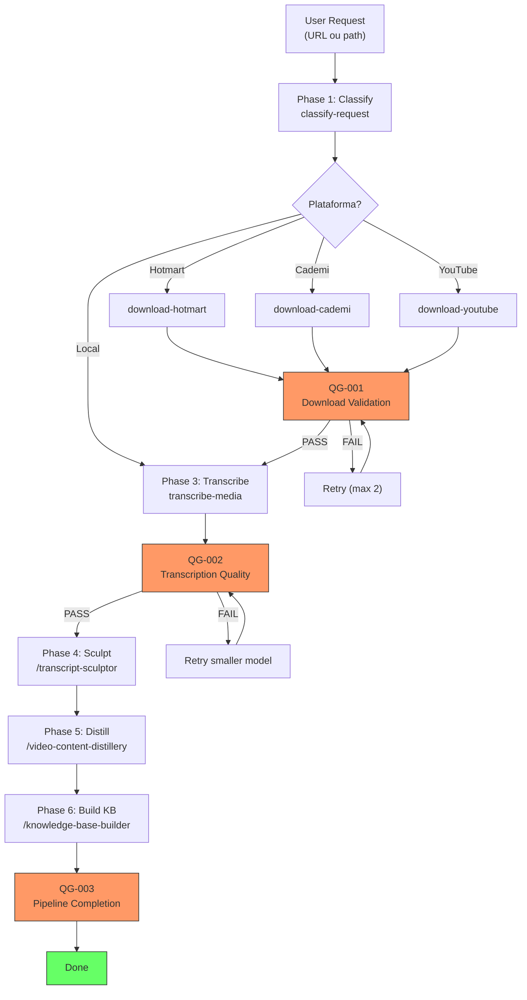

# Media Processor

**Meta-orchestrator** que unifica hotmart-downloader, cademi-downloader, aios-transcriber, transcript-sculptor, video-content-distillery e knowledge-base-builder em um pipeline automatizado.

Um comando do usuário → pipeline completo: download → transcrição → escultura editorial → destilação → knowledge base.

---

## Arquitetura



---

## Quick Start

```bash
# Ativar o agente
@media-chief

# Pipeline completo (Hotmart)
*process https://club.hotmart.com/palestrante-memoravel

# Pipeline completo (YouTube)
*process https://www.youtube.com/watch?v=xyz

# Apenas download
*download https://club.hotmart.com/curso

# Apenas transcrição (arquivo local)
*transcribe ~/videos/palestra.mp4

# Batch (curso inteiro com dashboard)
*batch https://www.youtube.com/playlist?list=PLxyz

# Resumir sessão interrompida
*resume squads/media-processor/sessions/mp-2026-0223-001/
```

---

## Plataformas Suportadas

| Plataforma | URL Pattern | Ferramenta |
|-----------|-------------|------------|
| Hotmart | `*.hotmart.com` | hotmart-dl |
| Cademi | `*.cademi.com.br` | cademi-dl |
| YouTube | `youtube.com/watch`, `youtu.be/` | aios-transcriber |
| YouTube Playlist | `youtube.com/playlist` | aios-transcriber |
| Arquivos locais | `.mp4`, `.mkv`, `.m4a`, `.wav` | aios-transcriber |

---

## Pipelines

| Pipeline | Comando | Fases | Uso |
|----------|---------|-------|-----|
| Full | `*process` | classify → download → transcribe → sculpt → distill → KB | URL única, pipeline completo |
| Download only | `*download` | classify → download | Apenas baixar mídia |
| Transcribe only | `*transcribe` | classify → transcribe | Arquivos locais |
| Batch | `*batch` | classify → download → transcribe → sculpt → distill → KB | Cursos, playlists |

---

## Estrutura

```
squads/media-processor/
├── config.yaml                              # Configuração do squad
├── README.md                                # Este arquivo
├── agents/
│   └── media-chief.md                       # Atlas — orchestrator
├── tasks/
│   ├── classify-request.md                  # Detectar plataforma e tipo
│   ├── download-hotmart.md                  # Download via hotmart-dl
│   ├── download-cademi.md                   # Download via cademi-dl
│   ├── download-youtube.md                  # Download via aios-transcriber
│   ├── transcribe-media.md                  # Transcrição via aios-transcriber
│   ├── sculpt-transcript.md                 # Delegação → transcript-sculptor
│   ├── distill-content.md                   # Delegação → video-content-distillery
│   ├── build-knowledge-base.md              # Delegação → knowledge-base-builder
│   ├── validate-download.md                 # QG-001
│   ├── validate-transcription.md            # QG-002
│   ├── validate-pipeline.md                 # QG-003
│   └── update-status.md                     # Status JSON management
├── workflows/
│   ├── wf-full-pipeline.md                  # Pipeline completo (6 fases)
│   ├── wf-download-only.md                  # Apenas download (2 fases)
│   ├── wf-transcribe-only.md               # Apenas transcrição (2 fases)
│   └── wf-batch-process.md                  # Batch com dashboard (6 fases)
├── checklists/
│   ├── download-validation-checklist.md     # QG-001 checklist
│   ├── transcription-quality-checklist.md   # QG-002 checklist
│   └── pipeline-completion-checklist.md     # QG-003 checklist
├── templates/
│   ├── pipeline-status-template.json        # Schema do status JSON
│   ├── manifest-template.json               # Schema do manifest
│   └── pipeline-report-template.md          # Template do relatório final
├── dashboard/
│   └── index.html                           # Dashboard HTML (auto-refresh)
├── data/
│   ├── media-processor-kb.md                # Knowledge base do squad
│   └── cli-reference.md                     # Referência CLI das ferramentas
└── sessions/                                # Sessões de processamento (runtime)
```

---

## Quality Gates

| Gate | Nome | Tipo | Quando |
|------|------|------|--------|
| QG-001 | Download Validation | Blocking | Após cada download |
| QG-002 | Transcription Quality | Blocking | Após cada transcrição |
| QG-003 | Pipeline Completion | Blocking | Ao final do pipeline |

---

## Dashboard

Dashboard HTML com auto-refresh (3s) para monitorar pipelines batch:

```bash
open squads/media-processor/dashboard/index.html
```

Lê `pipeline-status.json` da sessão ativa e exibe:
- Progress bar geral
- Status por fase
- Tabela de items com status
- Erros e warnings
- ETA estimado

---

## Dependências

### Ferramentas (tools/)
- `hotmart-downloader` — Download de cursos Hotmart
- `cademi-downloader` — Download de cursos Cademi
- `aios-transcriber` — Download YouTube + transcrição (caption extraction ou Whisper)

### Squads
- `transcript-sculptor` — Escultura editorial de transcrições
- `video-content-distillery` — Extração de frameworks e conteúdo
- `knowledge-base-builder` — Construção de knowledge bases

### Sistema
- `ffmpeg` / `ffprobe` — Processamento de mídia
- `yt-dlp` — Download de vídeos
- `whisper` — Transcrição de áudio (MLX/faster/OpenAI)

---

## Conceitos-Chave

### Per-Item Streaming
Cada item avança individualmente pelas fases. Não esperamos todos os downloads para começar a transcrever.

### Resume Support
Toda sessão tem `processing-manifest.json`. Se interrompido, `*resume` continua do ponto de parada.

### Error Isolation
Falha em 1 item não bloqueia os demais. Erros são isolados e reportados no summary final.

---

*Media Processor Squad v1.0.0 — Download. Transcribe. Distill. Done.*
