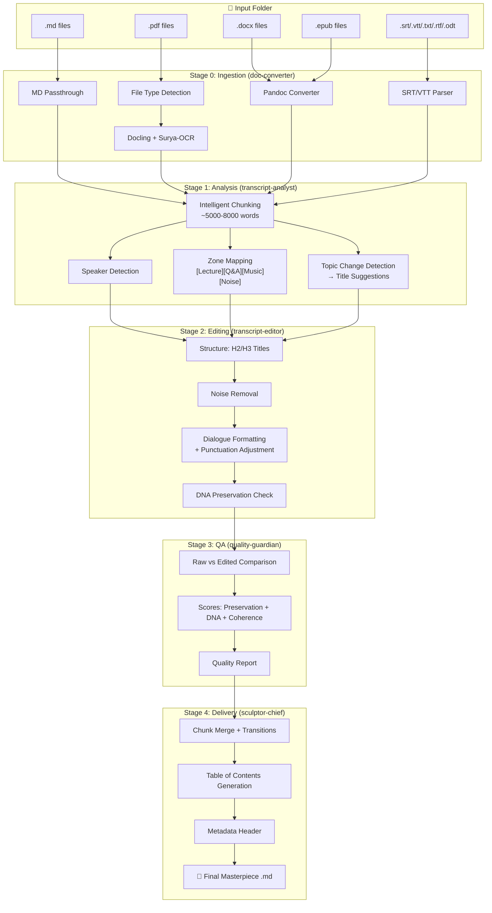
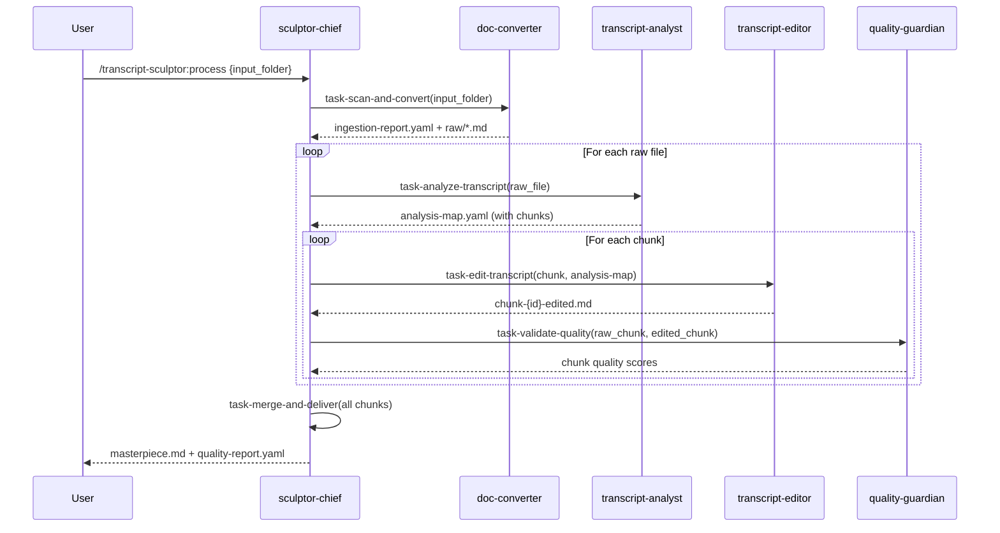
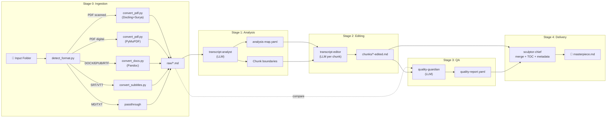

# Transcript Sculptor — Architecture Document

**Version:** 0.1
**Date:** 2026-02-22
**Author:** Aria (Architect) — based on PRD v0.1
**Status:** Draft

---

## Table of Contents

- [Introduction](#introduction)
- [High Level Architecture](#high-level-architecture)
- [Tech Stack](#tech-stack)
- [Data Models — Intermediate Artifacts](#data-models--intermediate-artifacts)
- [Components](#components)
- [Project Structure](#project-structure)
- [Core Workflow — Data Flow](#core-workflow--data-flow)
- [Coding Standards](#coding-standards)
- [Change Log](#change-log)

---

## Introduction

This document defines the complete architecture of the **transcript-sculptor** squad — an automated pipeline that transforms raw transcriptions and multi-format documents into 10/10 editorial-quality structured markdown. The system operates as an AIOS expansion pack, composed of 5 specialized agents orchestrated via workflow, with a Python/CLI conversion layer and intelligent LLM processing.

**Starter Template:** N/A — AIOS expansion pack, follows standard squad architecture conventions (`squads/knowledge-base-builder/`, `squads/content-engine/`).

---

## High Level Architecture

### Technical Summary

The transcript-sculptor is an AIOS squad with a 3-layer architecture: (1) **Orchestration layer** — markdown-driven agents coordinated by `sculptor-chief` via workflow YAML, (2) **Conversion layer** — Python scripts and CLI tools (Docling, Surya-OCR, Pandoc) for multi-format ingestion, and (3) **Intelligence layer** — LLM processing via Claude Code for semantic analysis, editorial structuring, and quality validation. The pipeline processes data in 5 sequential stages (ingest → analyze → edit → validate → deliver) with intelligent chunking for long content. All execution is local (macOS ARM64), no cloud dependencies, activatable via AIOS slash commands.

### Platform and Infrastructure

- **Platform:** Local macOS ARM64 (no cloud)
- **Key Services:** Python 3.13 (Docling, Surya-OCR, pymupdf), Pandoc CLI, Tesseract 5.5.2, Claude Code LLM
- **Deployment:** Local — squad installed at `~/aios-core/squads/transcript-sculptor/`

No cloud infrastructure. The pipeline runs entirely on the local host, using CLI tools for conversion and Claude Code as the intelligent processing engine.

### Repository Structure

- **Structure:** Monorepo (within `aios-core/`)
- **Location:** `squads/transcript-sculptor/`
- **Convention:** Standard AIOS squad (agents/, tasks/, workflows/, checklists/, data/, templates/)

### Architecture Diagram



### Architectural Patterns

- **Pipeline Pattern:** Sequential stages with well-defined intermediate artifacts between each stage — enables partial reprocessing and stage-by-stage debugging
- **Chunk-and-Merge Pattern:** Long transcriptions divided into processable blocks, processed independently, final merge with context overlap to ensure continuity
- **Agent-per-Stage Pattern:** Each AIOS agent specializes in one stage, with explicit inputs/outputs — single responsibility, isolated testability
- **HITL Escape Hatch:** Ambiguous excerpts marked `[REVISAR]` instead of automatic decision — preserves content when in doubt
- **Layered Architecture:** Conversion (deterministic, Python/CLI) separated from Intelligence (LLM-driven) — each layer can evolve independently

---

## Tech Stack

| Category | Technology | Version | Purpose | Rationale |
|----------|-----------|---------|---------|-----------|
| **Orchestration** | AIOS Squad Framework | 2.1.0 | Agent coordination, workflow execution | Native ecosystem, reuses existing infra |
| **LLM Engine** | Claude Code (Opus/Sonnet) | Current | Semantic analysis, structuring, editing, QA | Already available, high quality in PT-BR |
| **PDF OCR** | Docling + Surya-OCR | Latest | PDF → text with OCR for scanned documents | Best-in-class accuracy (94%+ scanned), macOS ARM64 |
| **PDF Text** | PyMuPDF (fitz) | Latest | Digital PDF text extraction | Fast, lightweight, no OCR overhead |
| **Doc Conversion** | Pandoc | Latest | DOCX/EPUB/RTF/ODT → Markdown | Universal converter, preserves structure |
| **Multi-format** | MarkItDown | Latest | Fallback converter, image OCR in docs | Microsoft tool, broad format support |
| **OCR Engine** | Tesseract | 5.5.2 | Backup OCR engine | Already installed, Surya backend |
| **Python Runtime** | Python | 3.13 | Conversion scripts execution | Homebrew, ARM64 native |
| **Config Format** | YAML | — | Analysis maps, workflow config | AIOS standard, human-readable |
| **Output Format** | Markdown (GFM) | — | Final document format | Universal, renderable everywhere |
| **Task Runner** | Claude Code Slash Commands | — | Pipeline invocation | `/transcript-sculptor:*` activation |

---

## Data Models — Intermediate Artifacts

### Ingestion Report (`ingestion-report.yaml`)

Output of Stage 0 (doc-converter):

```yaml
ingestion_report:
  input_folder: "/path/to/input"
  processed_at: "2026-02-22T14:30:00Z"
  files:
    - original: "palestra-dia1.md"
      format: "markdown"
      converter: "passthrough"
      output: "raw/palestra-dia1.md"
      status: "success"
      word_count: 42350
    - original: "material-complementar.pdf"
      format: "pdf-scanned"
      converter: "docling+surya"
      output: "raw/material-complementar.md"
      status: "success"
      word_count: 8200
      ocr_confidence: 0.96
    - original: "slides.pptx"
      format: "pptx"
      converter: "skipped"
      output: null
      status: "unsupported"
      reason: "PPTX not in supported formats"
  summary:
    total_files: 3
    processed: 2
    skipped: 1
    total_words: 50550
```

### Analysis Map (`analysis-map.yaml`)

Output of Stage 1 (transcript-analyst):

```yaml
analysis_map:
  source_file: "raw/palestra-dia1.md"
  total_words: 42350
  language: "pt-BR"
  speakers:
    - id: "speaker-1"
      label: "Palestrante Principal"
      estimated_percentage: 85
      tone: "energetic"
      characteristics: ["usa 'galera', 'olha só', 'percebam'"]
    - id: "speaker-2"
      label: "Participante (Q&A)"
      estimated_percentage: 10
      tone: "neutral"
    - id: "unknown"
      label: "Não identificado"
      estimated_percentage: 5
  zones:
    - type: "lecture"
      start_word: 0
      end_word: 12000
      title_suggestion: "Fundamentos do Método"
    - type: "qa"
      start_word: 12001
      end_word: 15000
      title_suggestion: "Perguntas e Respostas — Bloco 1"
    - type: "music"
      start_word: 15001
      end_word: 15200
      title_suggestion: null
      context: "Intervalo com música de fundo"
    - type: "noise"
      start_word: 15201
      end_word: 15400
      context: "Murmúrios e conversas paralelas"
      action: "remove"
    - type: "lecture"
      start_word: 15401
      end_word: 30000
      title_suggestion: "Aplicação Prática — Estudos de Caso"
  chunks:
    - id: "chunk-001"
      start_word: 0
      end_word: 7500
      zones: ["lecture"]
      overlap_context: "...último parágrafo do chunk para contexto do próximo..."
    - id: "chunk-002"
      start_word: 7200
      end_word: 15000
      zones: ["lecture", "qa"]
      overlap_context: "..."
  noise_candidates:
    - start_word: 15201
      end_word: 15400
      text_preview: "...então... [inaudível]... microfone... tá ligado..."
      confidence: 0.92
      recommendation: "remove"
    - start_word: 28500
      end_word: 28600
      text_preview: "Alguém pode fechar a porta?"
      confidence: 0.78
      recommendation: "review"
```

### Chunk Edit Result (`chunk-{id}-edited.md`)

Output of Stage 2 (transcript-editor):

```markdown
---
chunk_id: "chunk-001"
source: "raw/palestra-dia1.md"
word_count_before: 7500
word_count_after: 7320
words_removed: 180
removal_log:
  - type: "noise"
    text: "[murmúrios inaudíveis]"
    reason: "No substantive content"
  - type: "review"
    text: "Alguém pode fechar a porta?"
    reason: "Possibly relevant context"
    action: "[REVISAR]"
dna_indicators:
  catchphrases_preserved: ["galera", "olha só", "percebam"]
  tone_adjustments: 3
  paraphrased_sentences: 0
---

## Fundamentos do Método

**Palestrante Principal:**

Galera, olha só — o que eu quero mostrar pra vocês hoje...
```

### Quality Report (`quality-report.yaml`)

Output of Stage 3 (quality-guardian):

```yaml
quality_report:
  source: "raw/palestra-dia1.md"
  output: "output/palestra-dia1-masterpiece.md"
  processed_at: "2026-02-22T15:45:00Z"
  scores:
    content_preservation: 98.2
    dna_preservation: 9.1
    structural_coherence: 8.8
    overall: 8.7
  content_analysis:
    words_original: 42350
    words_final: 41580
    words_removed: 770
    words_removed_noise: 680
    words_removed_duplicates: 90
    words_marked_review: 12
  removed_excerpts:
    - text: "[murmúrios inaudíveis]..."
      reason: "noise"
  review_excerpts:
    - text: "Alguém pode fechar a porta?"
      location: "Section 3, paragraph 12"
      reason: "Possibly relevant stage direction"
  dna_analysis:
    catchphrases_found: ["galera", "olha só", "percebam", "sacou?"]
    catchphrases_preserved: 4
    catchphrases_lost: 0
    tone_consistency: "high"
    formality_level_maintained: true
  verdict: "PASS"
```

---

## Components

### sculptor-chief (Orchestrator)

- **Responsibility:** Coordinate end-to-end pipeline, manage chunking strategy, execute final merge, generate metadata and TOC
- **Interfaces:** Input folder path → final .md document
- **Dependencies:** All other agents (invokes sequentially)
- **Technology:** AIOS agent markdown + workflow YAML

### doc-converter (Tier 0)

- **Responsibility:** Folder scan, format detection, multi-format conversion → raw markdown
- **Interfaces:** Input folder → `raw/*.md` + `ingestion-report.yaml`
- **Dependencies:** Pandoc (CLI), Docling + Surya-OCR (Python), PyMuPDF (Python), MarkItDown (Python)
- **Technology:** Python scripts invoked via Bash tool

### transcript-analyst (Tier 1)

- **Responsibility:** Semantic analysis — speaker detection, zone mapping, topic identification, chunking
- **Interfaces:** `raw/*.md` → `analysis-map.yaml`
- **Dependencies:** LLM (Claude Code) for semantic analysis
- **Technology:** AIOS agent + LLM processing

### transcript-editor (Tier 1)

- **Responsibility:** Structural editing — titles, cleanup, formatting, punctuation, DNA preservation
- **Interfaces:** `raw/*.md` + `analysis-map.yaml` → `chunks/chunk-{id}-edited.md`
- **Dependencies:** LLM (Claude Code) for intelligent editing, analysis-map as guide
- **Technology:** AIOS agent + LLM processing

### quality-guardian (Tier 2)

- **Responsibility:** Quality validation — raw vs edited comparison, scoring, auditing
- **Interfaces:** `raw/*.md` + `chunks/*-edited.md` → `quality-report.yaml`
- **Dependencies:** LLM for semantic comparison, word count tools
- **Technology:** AIOS agent + LLM processing

### Component Interaction



---

## Project Structure

### Squad Directory

```
squads/transcript-sculptor/
├── agents/
│   ├── sculptor-chief.md          # Orchestrator — pipeline coordination
│   ├── doc-converter.md           # Tier 0 — format conversion + OCR
│   ├── transcript-analyst.md      # Tier 1 — semantic analysis + chunking
│   ├── transcript-editor.md       # Tier 1 — structural editing + DNA preservation
│   └── quality-guardian.md        # Tier 2 — quality validation + scoring
├── tasks/
│   ├── task-scan-and-convert.md   # Stage 0: Ingestion pipeline
│   ├── task-analyze-transcript.md # Stage 1: Analysis + mapping
│   ├── task-edit-transcript.md    # Stage 2: Editing + structuring
│   ├── task-validate-quality.md   # Stage 3: Quality validation
│   └── task-merge-and-deliver.md  # Stage 4: Merge + delivery
├── workflows/
│   └── wf-transcript-to-masterpiece.md  # Full pipeline workflow
├── checklists/
│   ├── conversion-quality-checklist.md   # Stage 0 quality gate
│   └── editorial-quality-checklist.md    # Stage 2-3 quality gate
├── data/
│   └── transcript-sculptor-kb.md  # Squad knowledge base
├── templates/
│   └── masterpiece-output-tmpl.md # Final document template
├── scripts/
│   ├── convert_pdf.py             # PDF → MD (Docling + Surya-OCR)
│   ├── convert_docs.py            # DOCX/EPUB/RTF → MD (Pandoc)
│   ├── convert_subtitles.py       # SRT/VTT → MD
│   ├── detect_format.py           # File type detection + routing
│   └── requirements.txt           # Python dependencies
├── docs/
│   ├── prd.md                     # Product Requirements Document
│   └── architecture.md            # This document
└── README.md                      # Quick start + examples
```

### Runtime Working Directory

```
{output_folder}/
├── raw/                           # Stage 0 output — converted raw .md files
├── analysis/                      # Stage 1 output — analysis maps
├── chunks/                        # Stage 2 output — edited chunks
├── reports/                       # Stage 3 output — quality reports
├── ingestion-report.yaml          # Stage 0 summary
└── {source}-masterpiece.md        # FINAL OUTPUT
```

---

## Core Workflow — Data Flow



---

## Coding Standards

### Critical Rules

- **DNA Preservation First:** Never summarize, paraphrase, or alter meaning. When in doubt, mark `[REVISAR]`
- **Chunk Overlap:** Always include ~200 words of overlap between chunks for merge context
- **Analysis Map is Source of Truth:** Editor MUST follow the analysis-map — do not invent titles or zones not in the map
- **Idempotent Stages:** Each stage can be re-executed in isolation without affecting previous stages
- **Conversion Scripts are Deterministic:** Python scripts do not use LLM — output is deterministic and reproducible
- **Quality Report Always Generated:** Even in partial reprocessing, quality report MUST be updated

### Naming Conventions

| Element | Convention | Example |
|---------|-----------|---------|
| Agent files | kebab-case.md | `sculptor-chief.md` |
| Task files | task-kebab-case.md | `task-analyze-transcript.md` |
| Python scripts | snake_case.py | `convert_pdf.py` |
| Analysis maps | source-analysis-map.yaml | `palestra-dia1-analysis-map.yaml` |
| Edited chunks | source-chunk-NNN-edited.md | `palestra-dia1-chunk-001-edited.md` |
| Quality reports | source-quality-report.yaml | `palestra-dia1-quality-report.yaml` |
| Final output | source-masterpiece.md | `palestra-dia1-masterpiece.md` |

---

## Change Log

| Date | Version | Description | Author |
|------|---------|-------------|--------|
| 2026-02-22 | 0.1 | Initial architecture based on PRD v0.1 | Aria (Architect) |
